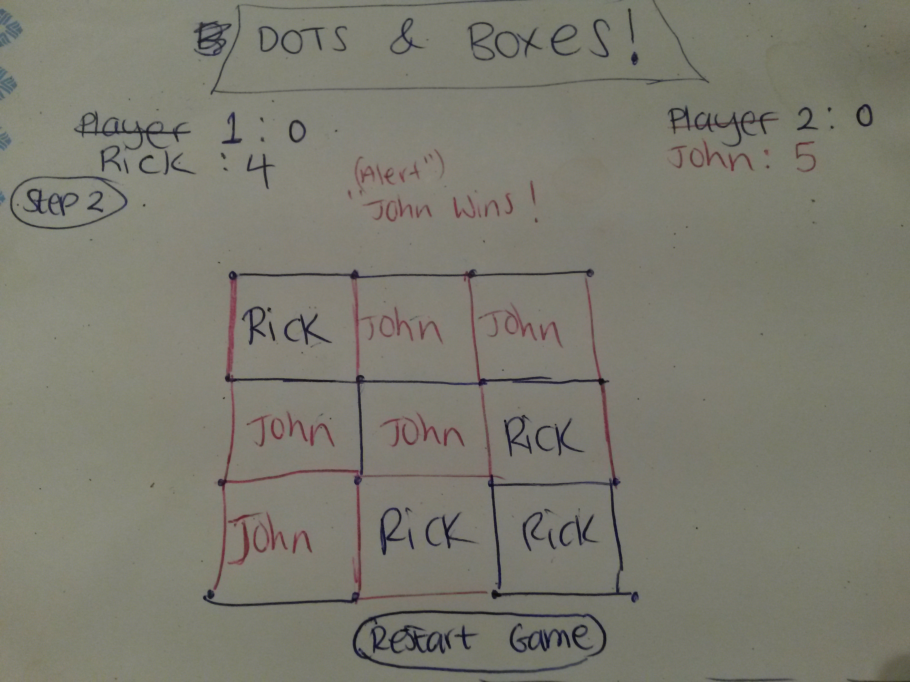

# Project 1: Dots & Boxes!
-

#### Introduction 

Dots and Boxes! This is a game of strategy and skill that is great fun to play. Each player takes turns connecting one dot to another adjacent dot horizontally or vertically one move at a time. To create a box, you must draw the last line that creates it. For every box created, the player gets an extra turn. The player with the most boxes wins.

-

#### Approach

I used HTML to create the grid as a table. I used an image to create the orange ball instead of having a plain black dot. I used the CSS to style the grid and look more appealing such as the image background and hover features for the lines. JAVA-SCRIPT and JQUERY were used to switch turns, create the lines and make boxes. 

-
#### Technologies Used 

HTML, CSS, JAVA-SCRIPT and JQUERY. 

-
#### User stories 

Click here: [User Stories](https://trello.com/b/MjmSTWtc/project-1)

-
#### Wire frame 

-
#### MVP 
The minimum requirements are that both players are able to take turns making red or blue lines in order to create boxes and to know which boxes they made and who the winner is with an alert.

#### Unresolved Problems
When a player clicks outside of the lines such as inside the box, the box becomes complete without drawing all four lines to connect them. Also if I don't click exactly on a line, the line closest to where I clicked will appear and sometimes it's not the right line that appears.

-
Click here for github [link](https://github.com/rapersad/Project-1) and clone the respository.