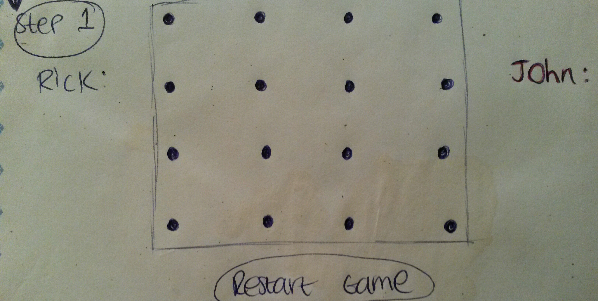

# Project 1: Dots & Boxes!
-

#### Introduction 

Dots and Boxes! This is a game of strategy and skill that is great fun to play. The object of the game is to draw more boxes than your opponent. To play the game, each player takes turns to draw a horizontal or vetical line connecting any two dots. The person with the most boxes wins.

-

#### Approach

I will use HTML to create the grid. CSS to style the grid and look more appealing. JAVA-SCRIPT and J-QUERY will be used to code the lines drawn on the grid to create the boxes. 

-
#### Technologies Used 

HTML, CSS, JAVA-SCRIPT and J-QUERY. 

-
#### User stories 

Click here: [User Stories](https://trello.com/b/MjmSTWtc/project-1)

-
#### Wire frame 

-
#### MVP 
The minimum requirements are that both players are able to take turns making lines in order to create boxes and know who the winner is.

-
Click here for github [link](https://github.com/rapersad/Project-1) and clone the respository.